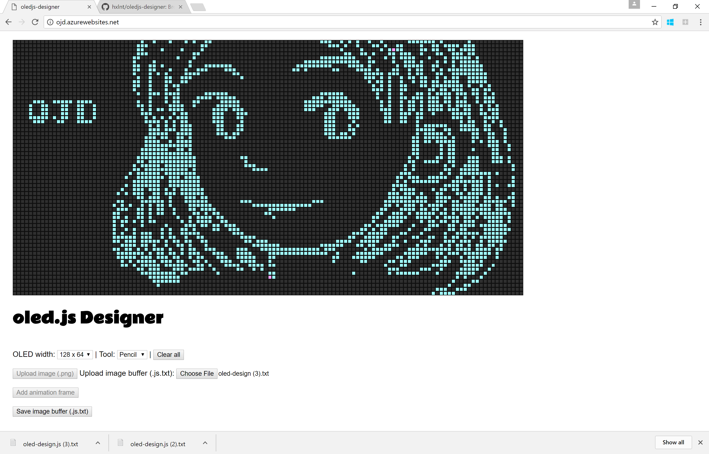

# oledjs-designer
Work in progress! A browser-based design tool to accompany [oled.js](https://github.com/noopkat/oled-js).

## What does it allow you to do?
`oledjs-designer` can help you design graphics for small monochrome OLED screens. It's built for use with [oled.js](https://github.com/noopkat/oled-js), a super-rad library for drawing to OLEDs via Javascript.

 - Use a touchscreen stylus (or mouse) to draw screens
 - Export your drawing as a `.js` buffer file ready for use with `oled-js`

 
 
 ## What will it eventually allow you to do? (aka //TODO)
  - DONE! <s>Choose from multiple OLED resolutions</s>
  - DONE! <s>Upload a `.js` buffer file for editing/preview</s>
  - DONE! <s>Draw with tablet stylus with less difficulty</s>
  - Upload a `.png` for editing/preview
  - Select different color schemes, including color-banded monochrome displays
  - Erase/fill/other drawing tools
  - Add onion-skinned frames for animations (via drawing or `.png` upload)
